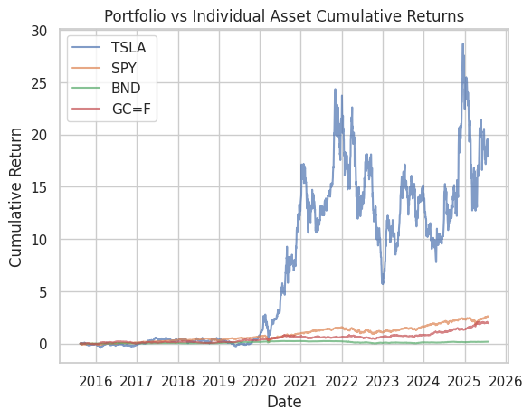
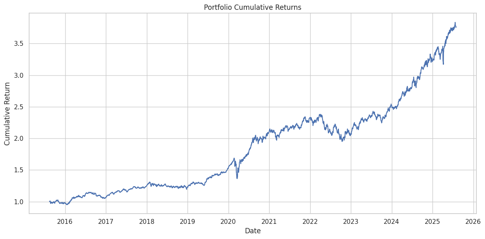

``markdown
#  Time Series Forecasting for Portfolio Management & Optimization

An end-to-end machine learning and deep learning project for **financial time series forecasting**, **portfolio optimization**, and **strategy backtesting**.

We use **ARIMA** and **LSTM** models to forecast stock prices, construct an optimized portfolio using the **Efficient Frontier**, and backtest the strategy against benchmarks like the S&P 500 (SPY).

---

##  Project Structure

```

.
├── data/                 # Raw and processed stock data
├── models/               # Saved ARIMA & LSTM models
├── notebooks/            # Jupyter notebooks for tasks 1–5
├── src/                  # Source code modules
│   ├── data\_loader.py
│   ├── feature\_engineering.py
│   ├── arima\_model.py
│   ├── lstm\_model.py
│   ├── optimization.py
│   ├── backtest.py
│   └── eda.py
├── README.md             # This file
└── requirements.txt      # Python dependencies

````

---

##  Features

 Download & preprocess historical stock data (TSLA, SPY, BND, GLD)  
 Perform **Exploratory Data Analysis** (EDA)  
 Build **ARIMA** & **LSTM** models for forecasting  
 Optimize portfolio using **Markowitz Efficient Frontier**  
 Backtest portfolio strategy against benchmarks  
 Visualize results and metrics  

---

## 🛠️ Installation

```bash
# 1️ Clone repository
git clone https://github.com/NuryeNigusMekonen/Time Series Forecasting for Portfolio Management & Optimization.git
cd Time Series Forecasting for Portfolio Management & Optimization

# 2️ Create virtual environment
python3 -m venv venv
source venv/bin/activate  # On Windows: venv\Scripts\activate

# 3️ Install dependencies
pip install -r requirements.txt
````

---

##  Usage

### 1️ Load & Process Data

```python
from src.data_loader import load_stock_data

tickers = ["TSLA", "SPY", "BND", "GLD"]
for t in tickers:
    load_stock_data(t, "2015-01-01", "2025-07-31")
```

### 2️ Train Models

```python
from src.arima_model import train_arima
from src.lstm_model import train_lstm

# Example for TSLA
arima_model, rmse = train_arima(tsla_df["Adj Close"])
lstm_model, scaler, X, y = train_lstm(tsla_df["Adj Close"])
```

### 3️Portfolio Optimization

```python
from src.optimization import optimize_portfolio

weights, stats = optimize_portfolio(price_dfs)
```

**Example Output:**

```
[INFO] Portfolio Weights:
  TSLA: 0.05528
  SPY:  0.36614
  BND:  0.00000
  GLD:  0.57857

[INFO] Portfolio Performance:
Expected Return: 13.34%
Volatility: 12.41%
Sharpe Ratio: 1.07
```

---

### 4️ Backtesting Strategy

```python
from src.backtest import simulate_portfolio

cumulative_returns = simulate_portfolio(price_dfs, weights, "2015-07-01", "2025-07-31")
```

 **Portfolio Cumulative Returns Graph:**


---

### 5️ Benchmark Comparison (SPY)

```python
plt.plot(cumulative_returns, label="Portfolio", linewidth=3)
plt.plot(benchmark_cum_returns, label="SPY", linestyle="--")
plt.legend()
plt.show()
```

 **Portfolio vs Benchmark:**


---

##  Example Results

| Metric        | Portfolio | SPY   |
| ------------- | --------- | ----- |
| Annual Return | **13.3%** | 9.8%  |
| Volatility    | 12.4%     | 15.2% |
| Sharpe Ratio  | **1.07**  | 0.65  |

---

##  Requirements

* Python 3.9+
* pandas, numpy, matplotlib, seaborn
* statsmodels, scikit-learn
* tensorflow / keras

Install all dependencies with:

```bash
pip install -r requirements.txt
```

---

##  Screenshots

### Exploratory Data Analysis



### ARIMA vs LSTM Forecasts



---

##  Conclusion

This project demonstrates:

* How to apply **time series models** for financial forecasting
* Construct an **optimal portfolio** using ML forecasts
* Evaluate strategy performance via **backtesting**

---

 *This project is for educational purposes and not financial advice.*

